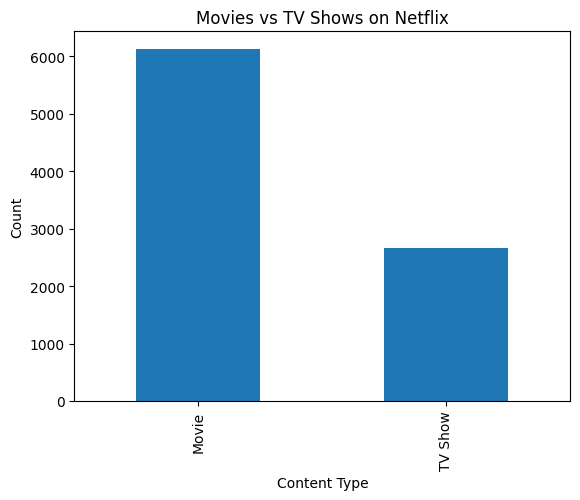

## 📌 Netflix Content Strategy Analysis
This project analyzes how Netflix evolved its content strategy from 2008 to 2021, focusing on content type, genres, and global expansion using data-driven insights.

## 🎯 Objective

To understand:
- Content distribution (Movies vs TV Shows)
    - Growth trends over time
    - Genre preferences
    - Global expansion strategy

- Tools Used
    - Python
    - Pandas
    - Matplotlib

## ❓ Key Questions
- What type of content dominates Netflix?
- Has Netflix shifted toward TV Shows over time?
- What genres are most common?
- Is Netflix expanding globally?

## 📊 Key Insights
- Movies dominate (~70%), indicating scalable content strategy  
- Rapid growth of TV Shows post-2015 suggests shift toward engagement-driven content  
- Strong presence of international content indicates global expansion
  
## 📊 Content Distribution

## 🧠 Conclusion
Netflix has evolved from a movie-heavy platform to a more diversified content provider, balancing scalability with strategic experimentation in TV shows and international content.

## 👨‍💻 Author
Manav Vora  
Aspiring Data Analyst
